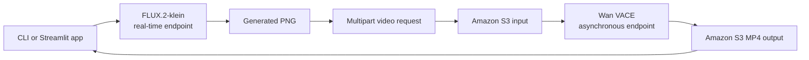

# Generate images and video with vLLM-Omni on SageMaker AI

This sample deploys two diffusion models with the
[AWS Deep Learning Container for vLLM-Omni](https://aws.github.io/deep-learning-containers/vllm-omni/):

- [FLUX.2-klein-4B](https://huggingface.co/black-forest-labs/FLUX.2-klein-4B)
  generates an image through a SageMaker real-time endpoint.
- [Wan2.1-VACE-1.3B](https://huggingface.co/Wan-AI/Wan2.1-VACE-1.3B-diffusers)
  animates that image through SageMaker Asynchronous Inference.

The command-line workflow and Streamlit application use the same deployment
state and request helpers.

## Architecture



The image endpoint returns an OpenAI-compatible JSON response containing a
base64-encoded PNG. The sample resizes that image to the video dimensions and
encodes it as a compact JPEG data URL so the multipart field remains below the
server's per-part size. It uploads the complete multipart request to Amazon S3,
invokes `/v1/videos/sync` through the asynchronous endpoint, and downloads the
MP4 from the returned output location.

## Prerequisites

- An AWS account with permissions to create SageMaker models, endpoint
  configurations, endpoints, and Amazon S3 objects.
- A SageMaker execution role that can read from the AWS Deep Learning Container
  registry and access the sample Amazon S3 bucket.
- Endpoint quota for one `ml.g6.xlarge` instance and one `ml.g6e.xlarge`
  instance in the selected AWS Region.
- Python 3.11 or later.

This sample pins `omni-sagemaker-cuda-v1.6`, which contains vLLM-Omni 0.26.0.
Review the
[vLLM-Omni DLC changelog](https://aws.github.io/deep-learning-containers/vllm-omni/changelog/)
before changing the tag.

## Install the dependencies

Create a virtual environment and install the sample dependencies:

```bash
python -m venv .venv
source .venv/bin/activate
python -m pip install -r requirements.txt
```

## Deploy the endpoints

Set the SageMaker execution role, then deploy both models in `us-east-1`:

```bash
export SAGEMAKER_ROLE_ARN=<your-sagemaker-execution-role-arn>

python deploy.py \
  --role-arn "$SAGEMAKER_ROLE_ARN" \
  --region us-east-1
```

The deployment script writes resource names to
`.vllm_omni_media_state.json`. Keep this file until you finish generation and
cleanup.

If your local AWS credentials expire while SageMaker is starting an endpoint,
refresh them and resume from the saved state:

```bash
python deploy.py \
  --role-arn "$SAGEMAKER_ROLE_ARN" \
  --region us-east-1 \
  --resume
```

The resume path reuses resources that already exist and creates only the
remaining resources.

FLUX.2-klein uses a real-time endpoint because its response completes within a
single invocation. Wan VACE uses SageMaker Asynchronous Inference because video
generation can exceed the response window for real-time inference. The
asynchronous endpoint is configured for one concurrent request per instance.

## Generate an image and video

Run the complete workflow:

```bash
python generate.py \
  --image-prompt "Cinematic photograph of a coastal observatory at sunrise" \
  --video-prompt "Slow camera push-in toward the coastal observatory; preserve the building and coastline"
```

The script writes the PNG and MP4 to `outputs/`. It also prints the Amazon S3
output location returned by SageMaker Asynchronous Inference.

The default video settings use 17 frames and 30 diffusion steps. This matches
the step count in the vLLM-Omni Wan VACE recipe while keeping the clip short.
Use `--video-steps 4` only for a quick endpoint smoke test, then assess output
quality, latency, and instance memory with your production settings.

## Run the Streamlit application

Start the local application after both endpoints reach `InService`:

```bash
streamlit run app.py
```

Generate the source image first, review it, then enter a motion prompt and
generate the video. The application can display and download both artifacts.

## Request routing

SageMaker sends inference traffic to `/invocations`. The vLLM-Omni SageMaker
image reads `CustomAttributes` and forwards the request to the selected
OpenAI-compatible route:

| Workload | Route | SageMaker inference option |
| --- | --- | --- |
| Image generation | `/v1/images/generations` | Real-time inference |
| Video generation | `/v1/videos/sync` | Asynchronous inference |

The Videos API accepts multipart form data. This sample pre-builds the
multipart body before uploading it to Amazon S3, which keeps the request format
explicit and works across vLLM-Omni DLC releases that accept multipart
requests. The asynchronous endpoint writes successful responses to `outputs/`
and invocation errors to `failures/` under the sample Amazon S3 prefix.

## Clean up

Delete the endpoints, endpoint configurations, and models:

```bash
python cleanup.py
```

The cleanup script retains generated objects under the Amazon S3 output prefix
so you can review them. Delete that prefix when you no longer need the
artifacts.

## Production considerations

Treat this sample as a deployment baseline, not a production architecture.
Before serving application traffic:

- Apply least-privilege IAM policies to the deployment identity and SageMaker
  execution role.
- Place endpoint traffic in your network design and configure encryption keys,
  logging, monitoring, and retention policies for your requirements.
- Load test each model separately, then set instance types, concurrency, and
  autoscaling from measured latency, memory, and throughput.
- Add input policy controls and output review appropriate for generated media.

Review
[SageMaker Asynchronous Inference](https://docs.aws.amazon.com/sagemaker/latest/dg/async-inference.html)
for payload, processing, scaling, and notification options.
