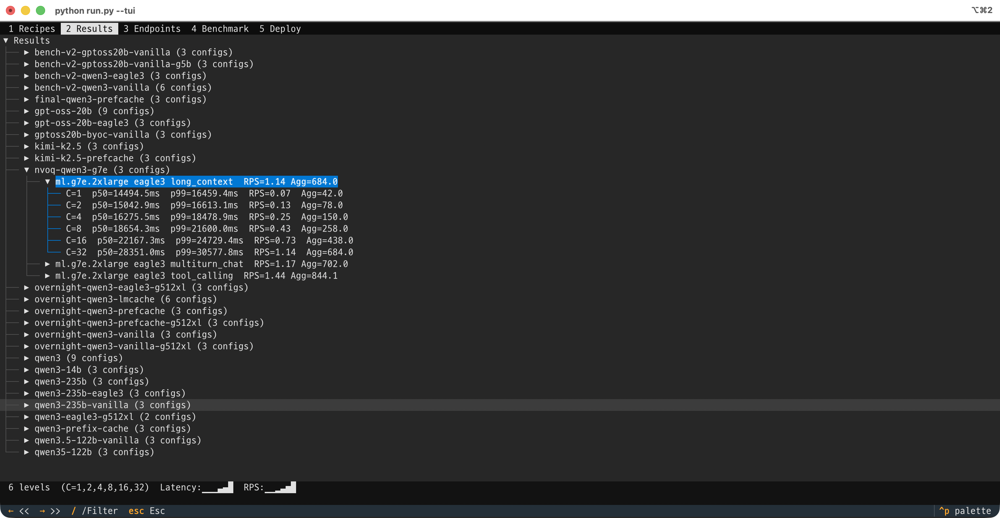

# SageMaker Inference Benchmark Suite

Config-driven framework for benchmarking LLM inference on Amazon SageMaker. Write a YAML recipe, run one command.



**31 pre-tested recipes** | **10 models** (Dense + MoE, 14B-744B) | **4 GPU generations** (Ampere → Blackwell → Hopper) | **5 optimizations** (EAGLE3, MTP, Prefix Cache, LMCache, KV Offload)

---

## Quick Start

```bash
pip install -r requirements.txt

# Interactive TUI dashboard (browse recipes, view results, manage endpoints)
python run.py --tui

# Validate a recipe (no AWS calls)
python run.py -f recipes/qwen3-32b-g7e-eagle3.yaml --dry-run

# Full pipeline: deploy → benchmark → cleanup (defined in YAML)
python run.py -f recipes/qwen3-32b-g7e-eagle3.yaml

# Benchmark existing endpoint only
python run.py -f recipes/recipe.yaml --only benchmark --endpoint NAME

# Ad-hoc (no recipe file)
python run.py --model Qwen/Qwen3-32B --instance ml.g7e.2xlarge \
  --role arn:aws:iam::ACCT:role/ROLE --deploy --benchmark --cleanup

# Standalone utilities
python run.py --report --cost ml.g7e.2xlarge=4.20
python run.py --status --region us-west-2
python run.py --cleanup --endpoint NAME
```

---

## Prerequisites

1. **AWS credentials** — configure via `aws configure`, environment variables, or EC2 Instance Role
2. **SageMaker IAM role** — set `endpoint.role_arn` in your recipe YAML (e.g., `arn:aws:iam::ACCOUNT:role/SageMakerExecutionRole`)
3. **GPU instance quota** — request quota for the instance type you plan to use (ml.g7e.2xlarge, ml.g6e.12xlarge, ml.p5e.48xlarge)
4. **Python 3.10+** — `pip install -r requirements.txt`

```bash
# Verify credentials
aws sts get-caller-identity

# Check SageMaker quota (example: g7e in us-west-2)
aws service-quotas get-service-quota \
  --service-code sagemaker \
  --quota-code L-1B2E2269 \
  --region us-west-2
```

---

## Interactive TUI

```bash
python run.py --tui
```

A terminal dashboard for browsing recipes, viewing results, and managing endpoints — all without leaving the terminal.

```
 1 Recipes  2 Results  3 Endpoints  4 Benchmark  5 Deploy
┌──────────────────────────────────────────────────────────┐
│ Recipe              Model           Instance    Opt      │
│ qwen3-32b-g7e-e..  Qwen3-32B       g7e.2xl     eagle3   │
│ qwen3-32b-g7e-v..  Qwen3-32B       g7e.2xl     vanilla  │
│ gpt-oss-20b-g7e..  GPT-OSS-20B     g7e.2xl     eagle3   │
└──────────────────────────────────────────────────────────┘
 Recipes: 44/44  Enter:actions  /:filter  </>:tabs  Esc:quit
```

**Key bindings:**

| Key | Action |
|-----|--------|
| `<` / `>` (arrows) | Switch tabs |
| `Up` / `Down` | Navigate rows |
| `Enter` | Action menu (execute, validate, benchmark, preview) |
| `/` | Filter/search |
| `1-5` | Jump to tab |
| `Esc` | Close menu/search, double-Esc to quit |

**Enter actions (Recipes tab):**
- `e` Execute full pipeline (deploy + benchmark + cleanup)
- `v` Validate (dry-run, no AWS calls)
- `b` Benchmark only
- `p` Preview YAML

Commands run inline — output streams directly in the TUI. Press `Esc` to return to the table.

---

## How It Works

### 3 Modes — Like `kubectl`

| Mode | Pattern | Analogy |
|------|---------|---------|
| **Recipe** (declarative) | `run.py -f recipe.yaml` | `kubectl apply -f` — YAML is the source of truth |
| **Ad-hoc** (imperative) | `run.py --deploy --model M --instance I` | `kubectl run` — CLI drives everything |
| **Standalone** (query) | `run.py --status` | `kubectl get` — no config needed |

### Recipe Mode — YAML Drives Pipeline

Every recipe defines **what** to deploy AND **what steps** to run:

```yaml
name: Qwen3-32B on g7e with EAGLE3
pipeline: [deploy, benchmark, cleanup]    # ← steps to execute
deployment:
  model:
    id: Qwen/Qwen3-32B
  instance:
    type: ml.g7e.2xlarge
  # ... container, vllm, optimization config
benchmark:
  concurrency_levels: [1, 2, 4, 8, 16, 32]
  # ... benchmark params
```

```bash
# Run the full pipeline — no flags needed
run.py -f recipes/qwen3-32b-g7e-eagle3.yaml

# Validate only (no AWS calls)
run.py -f recipes/recipe.yaml --dry-run

# Override which steps to run
run.py -f recipes/recipe.yaml --only benchmark --endpoint NAME
run.py -f recipes/recipe.yaml --only deploy
run.py -f recipes/recipe.yaml --skip cleanup

# Override parameters (YAML as base, CLI wins)
run.py -f recipes/recipe.yaml --image-uri public.ecr.aws/.../vllm:0.18-gpu-py312
run.py -f recipes/recipe.yaml --tp 2 --max-model-len 8192
```

### Ad-hoc Mode — CLI Drives Pipeline

For quick experiments without a recipe file:

```bash
run.py --model Qwen/Qwen3-32B --instance ml.g7e.2xlarge --deploy
run.py --model Qwen/Qwen3-32B --instance ml.g7e.2xlarge --deploy --benchmark --cleanup
```

### Standalone Utilities

```bash
run.py --status [--region us-west-2]
run.py --report [--results-dir DIR] [--cost ml.g7e.2xlarge=4.20]
run.py --cleanup --endpoint NAME [--region us-west-2]
```

### Pipeline Steps

| Step | Description |
|------|-------------|
| `deploy` | Deploy SageMaker endpoint from config |
| `benchmark` | Run throughput/latency benchmark |
| `kvcache` | KV cache effectiveness test (same vs diff prefix) |
| `report` | Generate markdown report from CSV results |
| `cleanup` | Delete endpoint and associated resources |

### Metrics Collected

Every benchmark run (streaming by default) measures:

| Metric                      | Scope       | Description                                                  |
|-----------------------------|-------------|--------------------------------------------------------------|
| `ttft_ms`                   | Per-request | Time To First Token, first SSE chunk arrival                 |
| `latency_ms`                | Per-request | Total response time (request to completion)                  |
| `input_tokens`              | Per-request | Prompt tokens (from vLLM `usage.prompt_tokens`)              |
| `output_tokens`             | Per-request | Completion tokens (from vLLM `usage.completion_tokens`)      |
| `tok_per_sec`               | Per-request | Output generation speed (`output_tokens / latency_sec`)      |
| `ttft_p50/p90/avg`          | Per-level   | TTFT percentiles across all requests at concurrency C        |
| `latency_p50/p90/p99`       | Per-level   | Latency percentiles                                          |
| `rps`                       | Per-level   | Requests/sec = `concurrency / avg_latency_sec`               |
| `aggregate_output_tok_sec`  | Per-level   | Total output throughput = `rps x avg_output_tokens`          |
| `$/M output tokens`         | Report      | Cost efficiency = `($/hr) / (agg_tok_sec x 3600) x 1M`       |

**Cost calculation notes:**
- Measured at **peak concurrency** (C=32) for maximum throughput
- Self-hosted pricing: instance $/hr is fixed, so output throughput determines cost efficiency
- Input tokens affect throughput indirectly (prefill time reduces available decode capacity)
- No model-specific or customer-specific assumptions — cost comes from `--cost` flag or YAML `cost.instance_cost_per_hour`

### Parameter Overrides (with `-f`)

| Arg | Description | Example |
|-----|-------------|---------|
| `--image-uri` | Container image URI | `public.ecr.aws/.../vllm:0.18-gpu-py312` |
| `--tp` | Tensor parallel size | `2` |
| `--max-model-len` | Max sequence length | `8192` |
| `--gpu-mem` | GPU memory utilization | `0.85` |
| `--max-tokens` | Max output tokens | `1024` |
| `--use-case` | Benchmark use cases | `multiturn_chat,tool_calling` |
| `--concurrency` | Concurrency levels | `1,4,16,32` |
| `--streaming` | Enable TTFT measurement | (flag) |
| `--endpoint` | Use existing endpoint | `bench-qwen3-32b-...` |

---

## Runbook

### Step 1: Choose or Create a Recipe

Browse [`recipes/`](recipes/) for 31 pre-tested recipes, or create your own:

```bash
cp recipes/template.yaml recipes/my-model.yaml
# Edit model ID, instance type, container, pipeline steps
python run.py -f recipes/my-model.yaml --dry-run
```

### Step 2: Run

```bash
# Full pipeline (deploy → benchmark → cleanup)
python run.py -f recipes/qwen3-32b-g7e-eagle3.yaml

# Deploy only (skip benchmark + cleanup)
python run.py -f recipes/recipe.yaml --only deploy

# Benchmark existing endpoint, then cleanup
python run.py -f recipes/recipe.yaml --only benchmark,cleanup --endpoint NAME

# Quick test (override concurrency + requests)
python run.py -f recipes/recipe.yaml --only benchmark --endpoint NAME \
  --use-case multiturn_chat --concurrency 1,4 --requests 5
```

### Step 3: Report & Status

```bash
python run.py --report --cost ml.g7e.2xlarge=4.20 ml.p5e.48xlarge=80.00
python run.py --status --region us-west-2
python run.py --cleanup --endpoint NAME
```

---

## Recipe Library (31 configs)

### Qwen3-32B (Dense 32B) — 12 recipes

| Recipe | Instance | Optimization | Container |
|--------|----------|-------------|-----------|
| [`qwen3-32b-g7e-vanilla`](recipes/qwen3-32b-g7e-vanilla.yaml) | ml.g7e.2xlarge | Vanilla | vLLM 0.15.1 cu129 |
| [`qwen3-32b-g7e-prefix-cache`](recipes/qwen3-32b-g7e-prefix-cache.yaml) | ml.g7e.2xlarge | Prefix Cache | vLLM 0.15.1 cu129 |
| [`qwen3-32b-g7e-eagle3`](recipes/qwen3-32b-g7e-eagle3.yaml) | ml.g7e.2xlarge | EAGLE3 | vLLM 0.15.1 cu129 |
| [`qwen3-32b-g7e-lmcache`](recipes/qwen3-32b-g7e-lmcache.yaml) | ml.g7e.2xlarge | LMCache | vLLM 0.15.1 cu129 |
| [`qwen3-32b-g6e-vanilla`](recipes/qwen3-32b-g6e-vanilla.yaml) | ml.g6e.12xlarge | Vanilla | vLLM 0.15.1 cu129 |
| [`qwen3-32b-g6e-prefix-cache`](recipes/qwen3-32b-g6e-prefix-cache.yaml) | ml.g6e.12xlarge | Prefix Cache | vLLM 0.15.1 cu129 |
| [`qwen3-32b-g6e-eagle3`](recipes/qwen3-32b-g6e-eagle3.yaml) | ml.g6e.12xlarge | EAGLE3 | vLLM 0.15.1 cu129 |
| [`qwen3-32b-g6e-lmcache`](recipes/qwen3-32b-g6e-lmcache.yaml) | ml.g6e.12xlarge | LMCache | vLLM 0.15.1 cu129 |
| [`qwen3-32b-g5-vanilla`](recipes/qwen3-32b-g5-vanilla.yaml) | ml.g5.12xlarge | Vanilla | vLLM 0.11.0 cu128 |
| [`qwen3-32b-g5-prefix-cache`](recipes/qwen3-32b-g5-prefix-cache.yaml) | ml.g5.12xlarge | Prefix Cache | vLLM 0.11.0 cu128 |
| [`qwen3-32b-g5-eagle3`](recipes/qwen3-32b-g5-eagle3.yaml) | ml.g5.12xlarge | EAGLE3 | vLLM 0.11.0 cu128 |
| [`qwen3-32b-g5-lmcache`](recipes/qwen3-32b-g5-lmcache.yaml) | ml.g5.12xlarge | LMCache | vLLM 0.11.0 cu128 |

### GPT-OSS-20B (MoE 3.6B active) — 6 recipes

| Recipe | Instance | Optimization | Container |
|--------|----------|-------------|-----------|
| [`gpt-oss-20b-g7e-vanilla`](recipes/gpt-oss-20b-g7e-vanilla.yaml) | ml.g7e.2xlarge | Vanilla | vLLM 0.15.1 cu129 |
| [`gpt-oss-20b-g7e-eagle3`](recipes/gpt-oss-20b-g7e-eagle3.yaml) | ml.g7e.2xlarge | EAGLE3 | vLLM 0.15.1 cu129 |
| [`gpt-oss-20b-g7e-lmcache`](recipes/gpt-oss-20b-g7e-lmcache.yaml) | ml.g7e.2xlarge | LMCache | vLLM 0.15.1 cu129 |
| [`gpt-oss-20b-g6e-vanilla`](recipes/gpt-oss-20b-g6e-vanilla.yaml) | ml.g6e.12xlarge | Vanilla | vLLM 0.15.1 cu129 |
| [`gpt-oss-20b-g6e-eagle3`](recipes/gpt-oss-20b-g6e-eagle3.yaml) | ml.g6e.12xlarge | EAGLE3 | vLLM 0.15.1 cu129 |
| [`gpt-oss-20b-g5-vanilla`](recipes/gpt-oss-20b-g5-vanilla.yaml) | ml.g5.12xlarge | Vanilla | BYOC vLLM 0.10.2 |

### Large Models on p5e.48xlarge (8xH200, 640GB VRAM) — 8 recipes

| Recipe | Model | Params (Active) | Optimization | Container |
|--------|-------|----------------|-------------|-----------|
| [`kimi-k2.5-p5e-vanilla`](recipes/kimi-k2.5-p5e-vanilla.yaml) | Kimi K2.5 | 1T (32B) | Vanilla | DJL LMI v20 |
| [`qwen3-235b-p5e-vanilla`](recipes/qwen3-235b-p5e-vanilla.yaml) | Qwen3-235B-A22B | 235B (22B) | Vanilla | DJL LMI v20 |
| [`qwen3-235b-p5e-eagle3`](recipes/qwen3-235b-p5e-eagle3.yaml) | Qwen3-235B-A22B | 235B (22B) | EAGLE3 | DJL LMI v20 |
| [`qwen3.5-122b-p5e-vanilla`](recipes/qwen3.5-122b-p5e-vanilla.yaml) | Qwen3.5-122B-A10B | 122B (10B) | Vanilla | vLLM 0.17.0 |
| [`llama4-scout-p5e-vanilla`](recipes/llama4-scout-p5e-vanilla.yaml) | Llama-4-Scout-17B-16E | 109B (17B) | Vanilla | vLLM 0.17.0 |
| [`llama4-maverick-p5e-vanilla`](recipes/llama4-maverick-p5e-vanilla.yaml) | Llama-4-Maverick-17B-128E | 400B+ (17B) | Vanilla | vLLM 0.17.0 |
| [`glm5-fp8-p5e-vanilla`](recipes/glm5-fp8-p5e-vanilla.yaml) | GLM-5-FP8 | 744B (40B) | Vanilla | vLLM 0.17.0 |
| [`glm5-fp8-p5e-mtp`](recipes/glm5-fp8-p5e-mtp.yaml) | GLM-5-FP8 | 744B (40B) | MTP Spec Decode | vLLM 0.17.0 |

### Small/Medium Models on g7e — 5 recipes

| Recipe | Model | Params (Active) | Container |
|--------|-------|----------------|-----------|
| [`qwen3-14b-g7e-vanilla`](recipes/qwen3-14b-g7e-vanilla.yaml) | Qwen3-14B | 14B (Dense) | vLLM 0.15.1 cu129 |
| [`qwen3-30b-a3b-g7e-vanilla`](recipes/qwen3-30b-a3b-g7e-vanilla.yaml) | Qwen3-30B-A3B | 30B (3B) | vLLM 0.15.1 cu129 |
| [`qwen3.5-35b-a3b-g7e-vanilla`](recipes/qwen3.5-35b-a3b-g7e-vanilla.yaml) | Qwen3.5-35B-A3B | 35B (3B) | vLLM 0.17.0 cu129 |
| [`deepseek-16b-g7e-vanilla`](recipes/deepseek-16b-g7e-vanilla.yaml) | DeepSeek-MoE-16B | 16B (MoE) | vLLM 0.17.0 cu129 |
| [`gpt-oss-120b-g7e-vanilla`](recipes/gpt-oss-120b-g7e-vanilla.yaml) | GPT-OSS-120B | 117B (5.1B MXFP4) | BYOC vLLM 0.10.2 |

---

## YAML Recipe Format

See [`recipes/template.yaml`](recipes/template.yaml) for the full annotated schema.

```yaml
name: "Qwen3-32B on g7e with EAGLE3"
pipeline: [deploy, benchmark, cleanup]     # steps to execute

deployment:
  model:
    id: "Qwen/Qwen3-32B"
  instance:
    type: "ml.g7e.2xlarge"
  container:
    type: "vllm-dlc"
    version: "0.15.1"
    cuda: "cu129"
  vllm:
    tensor_parallel_size: 1
    max_model_len: 4096
    gpu_memory_utilization: 0.9
  speculative_decoding:
    enabled: true
    method: "eagle3"
    model: "RedHatAI/Qwen3-32B-speculator.eagle3"
  prefix_caching:
    enabled: true
  endpoint:
    pattern: "standard"
    role_arn: "arn:aws:iam::ACCOUNT:role/ROLE"

benchmark:
  concurrency_levels: [1, 2, 4, 8, 16, 32]
  requests_per_level: 30
  inference_params:
    max_tokens: 600
    extra_payload:
      chat_template_kwargs:
        enable_thinking: false

cost:
  instance_cost_per_hour: 4.20
```

### Adding a New Model

1. Copy `recipes/template.yaml` to `recipes/<model>-<instance>-<optimization>.yaml`
2. Fill in model ID, instance type, container, vLLM params
3. Set `pipeline` steps as needed
4. Validate: `python run.py -f recipes/your-recipe.yaml --dry-run`
5. Run: `python run.py -f recipes/your-recipe.yaml`

---

## Key Results (C=32, Multiturn Chat)

| # | Model | Instance | Optimization | Agg tok/s | $/M tokens |
|---|-------|----------|-------------|-----------|-----------|
| 1 | GPT-OSS-20B | g7e.2xl | EAGLE3 | 3,720 | **$0.31** |
| 2 | GPT-OSS-20B | g7e.2xl | Vanilla | 3,102 | $0.38 |
| 3 | Qwen3-32B | g7e.2xl | EAGLE3 | 702 | **$1.66** |
| 4 | Qwen3.5-122B | p5e.48xl | Vanilla | 2,550 | $10.15 |
| 5 | Qwen3-235B | p5e.48xl | EAGLE3 | 2,115 | $10.51 |

### EAGLE3 Speculative Decoding Speedup (C=32)

| Model | Architecture | Multiturn | Tool Calling | Long Context |
|-------|-------------|-----------|-------------|-------------|
| Qwen3-32B | Dense 32B | 1.38x | **1.48x** | 1.18x |
| Qwen3-235B | MoE 22B active | 1.22x | **1.77x** | 1.36x |
| GPT-OSS-20B | MoE 3.6B active | 1.20x | **1.57x** | 1.34x |

> Tool calling consistently shows the highest EAGLE3 speedup (structured outputs).

---

## Container Compatibility Matrix

| Container | g5 (Ampere) | g6e (Ada) | g7e (Blackwell) | p5e (Hopper) |
|-----------|:-:|:-:|:-:|:-:|
| DLC vLLM 0.11.0 (cu128) | OK | - | - | - |
| DLC vLLM 0.15.1 (cu129) | - | OK | OK | - |
| DLC vLLM 0.17.0 (cu129) | - | OK | OK | OK |
| DJL LMI v20 (cu128) | OK | OK | - | OK |
| BYOC vllm-gpt-oss:v0.10.2 | OK | OK | OK | N/A |

> g7e (Blackwell) requires CUDA 12.9+. g5 (Ampere) requires CUDA 12.8. Validated automatically by the framework.

---

## Project Structure

```
├── run.py                          # CLI entry point (--tui, -f recipe, --status, etc.)
├── requirements.txt                # Python dependencies (boto3, sagemaker, textual, rich)
├── tui/
│   └── app.py                      # Interactive TUI dashboard (Textual)
├── recipes/
│   ├── template.yaml               # Annotated recipe template
│   └── *.yaml                      # 44 pre-tested recipes (10+ models)
├── scripts/
│   ├── config_loader.py            # YAML → dataclass, env vars, validation
│   ├── deployer.py                 # Deploy (standard + IC patterns + HyperPod)
│   ├── benchmarker.py              # Benchmark engine (streaming TTFT)
│   ├── benchmark_kvcache.py        # KV cache effectiveness test
│   ├── reporter.py                 # Markdown report + cost analysis
│   └── prompts.py                  # 3 use cases with shared system prompts
├── docker/
│   └── gpt-oss/                    # BYOC container for GPT-OSS
├── docs/
│   ├── BENCHMARK_RUNBOOK.md        # Step-by-step guide
│   └── BENCHMARK_METHODOLOGY.md    # Methodology docs
├── results/
│   └── matrix/                     # Final report + data zip
└── old/                            # Previous scripts & results
```

## Reports

| Report | Description |
|--------|-------------|
| [FINAL_REPORT_20260311.md](results/matrix/FINAL_REPORT_20260311.md) | Full 5-model, 22-config benchmark report |
| [BENCHMARK_RUNBOOK.md](docs/BENCHMARK_RUNBOOK.md) | Step-by-step execution guide |
| [BENCHMARK_METHODOLOGY.md](docs/BENCHMARK_METHODOLOGY.md) | Detailed methodology |
| [benchmark_data_20260311.zip](results/matrix/benchmark_data_20260311.zip) | All CSV data |

---

## Benchmark Output

When you run a benchmark, results are written to `results/matrix/`:

```
results/matrix/
  qwen3-32b_eagle3_g7e2xl_multiturn_chat_uswest2_20260311_143022.csv
  qwen3-32b_eagle3_g7e2xl_tool_calling_uswest2_20260311_143522.csv
  ...
  BENCHMARK_REPORT.md    # Auto-generated markdown report
```

Each CSV contains per-concurrency-level metrics:

| Column | Description |
|--------|-------------|
| `concurrency` | Number of parallel requests (1, 2, 4, 8, 16, 32) |
| `latency_p50/p90/p99` | Latency percentiles in milliseconds |
| `ttft_p50/p90` | Time to first token (streaming mode) |
| `rps` | Requests per second = `concurrency / avg_latency_sec` |
| `aggregate_output_tok_sec` | Total throughput = `rps * avg_output_tokens` |
| `tok_per_sec_avg` | Per-request token generation speed |
| `output_validation_rate` | Fraction of responses with meaningful content |

Generate a cost report:
```bash
python run.py --report --cost ml.g7e.2xlarge=4.20 ml.p5e.48xlarge=80.00
```

---

## Benchmark Data Sources

Prompts are defined in `scripts/prompts.py` with 3 use cases:

| Use Case | System Prompt | User Input | Purpose |
|----------|--------------|------------|---------|
| `multiturn_chat` | ~500 tokens (software eng) | 1-3 turn conversations | Prefix cache reuse as depth grows |
| `tool_calling` | ~500 tokens (10 tool defs) | Diverse tool queries | Structured output, shared prefix |
| `long_context` | ~100 tokens (analyst) | ~3K token documents | Document comprehension |

All use cases share a system prompt per type to enable prefix caching measurement. `max_tokens=600` for all.

---

## Roadmap

- [x] Prerequisites section
- [x] Benchmark output documentation
- [x] Interactive TUI
- [ ] `scripts/prompts.py` dataset structure docs
- [ ] HuggingFace tool calling dataset integration
- [ ] HyperPod support testing
